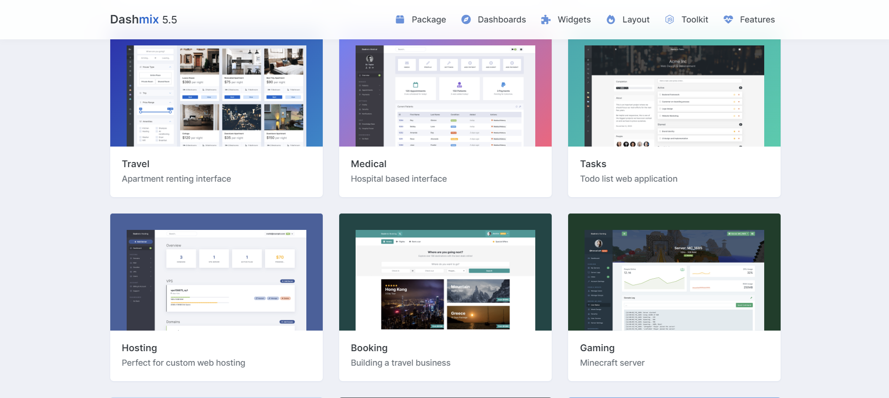
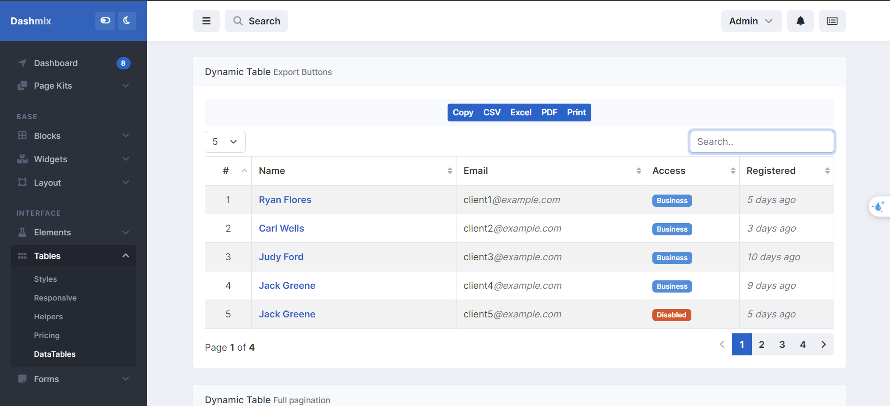

# Admin Theme - Free Admin Dashboard Template




## Introduction

Admin Theme is a versatile and free admin dashboard template designed to streamline the development of management systems, dashboards, and web applications. This theme comes with multiple dashboard layouts and a variety of built-in components, making it easy to adapt to different project requirements.

With a fully responsive design, Admin Theme ensures compatibility across multiple devices, providing a seamless experience whether you're using a desktop, tablet, or mobile.

## Features

- Multiple dashboard layouts to choose from
- Pre-built components like charts, tables, forms, and more
- Modern, clean, and intuitive user interface
- Fully responsive design, compatible with desktops, tablets, and mobile devices
- Easy to customize and extend for your project needs
- Cross-browser compatibility with major browsers (Chrome, Firefox, Safari, Edge)

## Demo

You can view the live demo at [link to demo if available].

## Installation

 Clone the repository from GitHub:
   ```bash
   git clone https://github.com/kieuvanquyet/admin-theme.git
